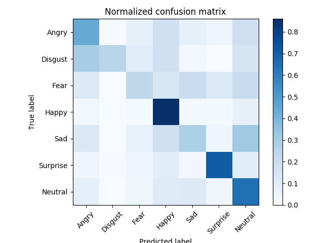
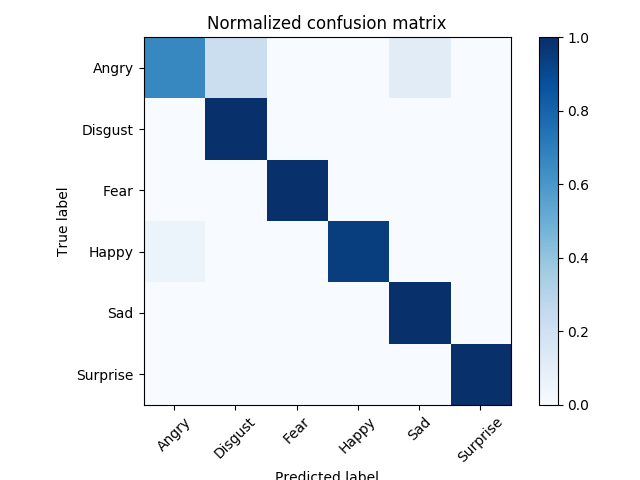

# PR_final
## Overview
This project is related to facial emotion recognition with face keypoint detection.

##  Installation
* Anaconda3 with python 3.6
* numpy
* openCV3: <br> <code>conda install -c conda-forge opencv</code>
* dlib: <br> <code>conda install -c conda-forge dlib</code>

## Dataset
* [fer2013](https://www.kaggle.com/c/challenges-in-representation-learning-facial-expression-recognition-challenge/data):
   7 emotions and 28709 examples
* [CK+](http://www.consortium.ri.cmu.edu/ckagree/): 7 emotions + neutral(I use 6 emotions ignored contempt) and 309 labeled images

## Training and Testing
  * add <code>-t yes</code> means training
  * add <code>-e yes</code> means testing  
  * add <code>-c yes</code> means convert dataset 
  * add <code>-j yes</code> means save face image
  * add <code>-d yes</code> means choice dataset  
  ```
  python main.py -t yes -e yes -c yes -d fer2013
  ```
## Demo
  * add <code>-d yes</code> means choice dataset
  ```
  python webcam.py -d fer2013
  ```

## Result  
* fer2013: 
  * test set accuracy = 58.9% 
  * validation set accuracy = 58.3%
  * confusion matrix
  
* CK+: 
  * validation set(20%) accuracy = 93.5%
  * confusion matrix
  
